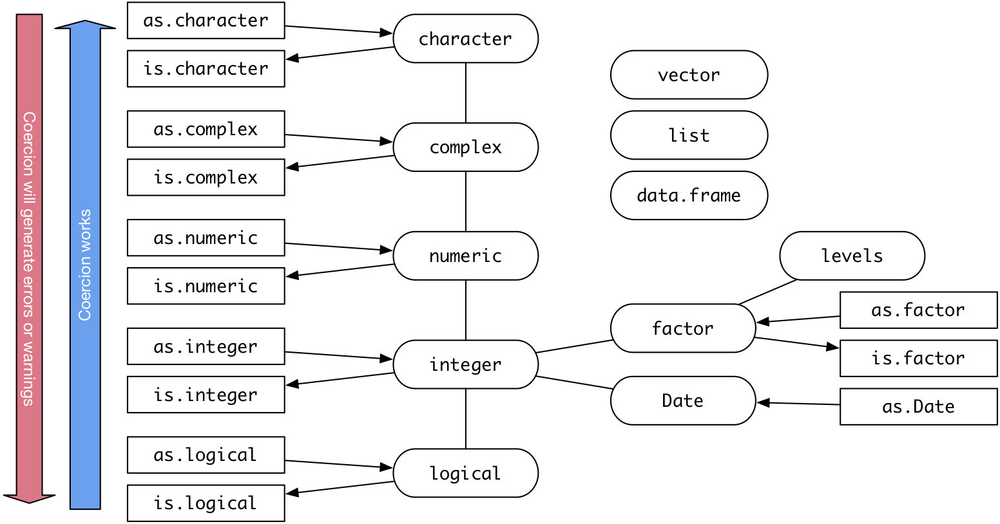
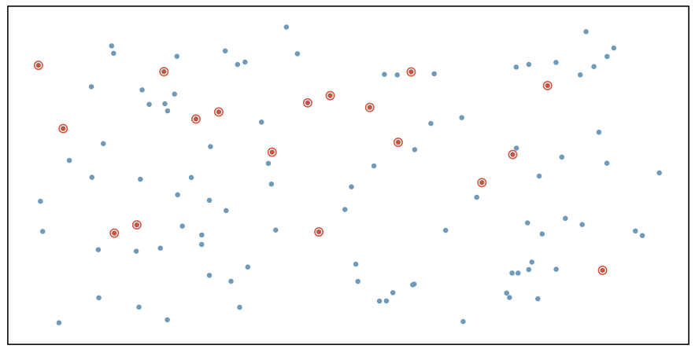
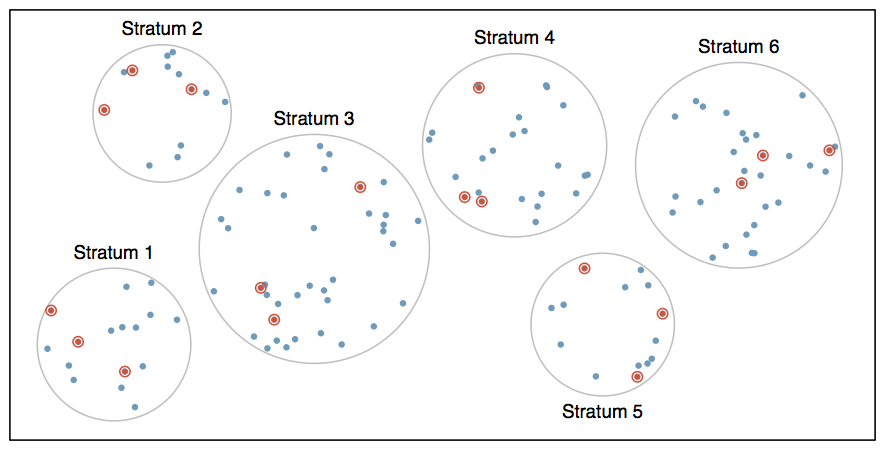
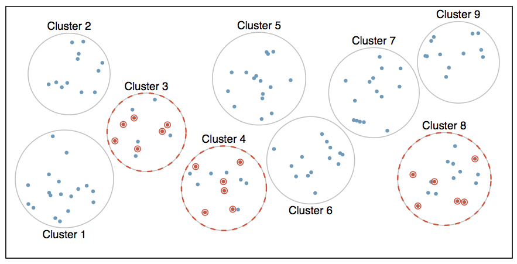
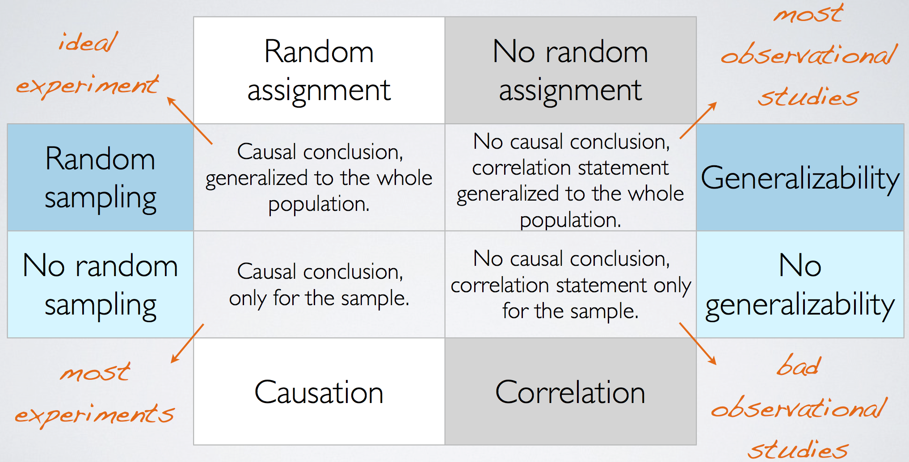

<div class="notes">
Documentation on using ioslides is available here:
http://rmarkdown.rstudio.com/ioslides_presentation_format.html
Some slides are adopted (or copied) from OpenIntro: https://www.openintro.org/
</div>

```{r, echo=FALSE, results='hide'}
library(lego)
data(legosets)
```

## Announcements

* Slack Channel: https://data606fall2018.slack.com
	* [Click here to join the group](https://join.slack.com/t/data606fall2018/shared_invite/enQtNDIwODAzMzg4MjE1LTdkZmM2ODIwZDVjOWI3MTFkZDc1MjcxMTljNWVkYTI2ZTg5ZTEzODRhZDJlYTM4YjE4NThjZWJmZTJhZGMxMjE) - You must click this link as it serves as the invitation to the channel.
* Completing labs - You may submit a PDF (even if created from the browser) or provide a link to Rpubs. Blackboard will not let you submit HTML files.
* Working Directories - See this page: http://data606.net/post/2018-08-28-getting-started-with-r/
* You can view the RMarkdown source for the Meetup slides here: https://github.com/jbryer/DATA606Fall2018/tree/master/Slides

## Intro to Data

We will use the `lego` R package in this class which contains information about every Lego set manufactured from 1970 to 2014, a total of 5710 sets.

```{r, eval=FALSE}
devtools::install_github("seankross/lego")
```
```{r}
library(lego)
data(legosets)
```

## Types of Variables

* Numerical (quantitative)
	* Continuous
	* Discrete
* Categorical (qualitative)
	* Regular categorical
	* Ordinal

## Data Types in R

<center></center>


## Types of Variables

```{r}
str(legosets)
```

## Qualitative Variables

Descriptive statistics:

* Contingency Tables
* Proportional Tables

Plot types:

* Bar plot
* Mosaic plot

## Contingency Tables

```{r}
table(legosets$Availability, useNA='ifany')
```

```{r}
table(legosets$Availability, legosets$Packaging, useNA='ifany')
```

## Proportional Tables {.flexbox .vcenter}

```{r}
prop.table(table(legosets$Availability))
```

## Bar Plots {.flexbox .vcenter}

```{r}
barplot(table(legosets$Availability), las=3)
```

## Bar Plots {.flexbox .vcenter}

```{r}
barplot(prop.table(table(legosets$Availability)), las=3)
```

## Mosaic Plot

```{r, message=FALSE}
library(vcd)
mosaic(HairEyeColor, shade=TRUE, legend=TRUE)
```

## Quantitative Variables

Descriptive statistics:

* Mean
* Median
* Quartiles
* Variance: ${ s }^{ 2 }=\sum _{ i=1 }^{ n }{ \frac { { \left( { x }_{ i }-\bar { x }  \right)  }^{ 2 } }{ n-1 }  }$
* Standard deviation: $s=\sqrt{s^2}$

Plot types:

* Dot plots
* Histograms
* Density plots
* Box plots
* Scatterplots

## Measures of Center

```{r}
mean(legosets$Pieces, na.rm=TRUE)
median(legosets$Pieces, na.rm=TRUE)
```

## Measures of Spread {.columns-2}

```{r}
var(legosets$Pieces, na.rm=TRUE)
sqrt(var(legosets$Pieces, na.rm=TRUE))
sd(legosets$Pieces, na.rm=TRUE)
```
<br />
```{r}
fivenum(legosets$Pieces, na.rm=TRUE)
IQR(legosets$Pieces, na.rm=TRUE)
```

## The `summary` Function

```{r}
summary(legosets$Pieces)
```

## The `psych` Package

```{r, message=FALSE, warning=FALSE}
library(psych)
describe(legosets$Pieces, skew=FALSE)
describeBy(legosets$Pieces, group = legosets$Availability, skew=FALSE, mat=TRUE)
```

## Robust Statistics

Median and IQR are more robust to skewness and outliers than mean and SD. Therefore,

* for skewed distributions it is often more helpful to use median and IQR to describe the center and spread
* for symmetric distributions it is often more helpful to use the mean and SD to describe the center and spread

## Dot Plot {.flexbox .vcenter}

```{r, fig.height=2.5}
stripchart(legosets$Pieces)
```

## Dot Plot {.flexbox .vcenter}

```{r, fig.height=4}
par.orig <- par(mar=c(1,10,1,1))
stripchart(legosets$Pieces ~ legosets$Availability, las=1)
par(par.orig)
```

## Histograms {.flexbox .vcenter}

```{r}
hist(legosets$Pieces)
```

## Transformations {.flexbox .vcenter}

With highly skewed distributions, it is often helpful to transform the data. The log transformation is a common approach, especially when dealing with salary or similar data.

```{r}
hist(log(legosets$Pieces))
```

## Density Plots {.flexbox .vcenter}

```{r}
plot(density(legosets$Pieces, na.rm=TRUE), main='Lego Pieces per Set')
```

## Density Plot (log tansformed) {.flexbox .vcenter}

```{r}
plot(density(log(legosets$Pieces), na.rm=TRUE), main='Lego Pieces per Set (log transformed)')
```

## Box Plots {.columns-2}

```{r, fig.width=3}
boxplot(legosets$Pieces)
```

```{r, fig.width=3}
boxplot(log(legosets$Pieces))
```

## Scatter Plots {.flexbox .vcenter}

```{r, fig.height=5}
plot(legosets$Pieces, legosets$USD_MSRP)
```

## Examining Possible Outliers (expensive sets)

```{r}
legosets[which(legosets$USD_MSRP >= 400),]
```

## Examining Possible Outliers (big sets)

```{r}
legosets[which(legosets$Pieces >= 4000),]
```

##  {.flexbox .vcenter}

```{r, fig.height=5}
plot(legosets$Pieces, legosets$USD_MSRP)
bigAndExpensive <- legosets[which(legosets$Pieces >= 4000 | legosets$USD_MSRP >= 400),]
text(bigAndExpensive$Pieces, bigAndExpensive$USD_MSRP, labels=bigAndExpensive$Name)
```


## Pie Charts

There is only one pie chart in *OpenIntro Statistics* (Diez, Barr, & Çetinkaya-Rundel, 2015, p. 48). Consider the following three pie charts that represent the preference of five different colors. Is there a difference between the three pie charts? This is probably a difficult to answer.

<center></center>


## Pie Charts

There is only one pie chart in *OpenIntro Statistics* (Diez, Barr, & Çetinkaya-Rundel, 2015, p. 48). Consider the following three pie charts that represent the preference of five different colors. Is there a difference between the three pie charts? This is probably a difficult to answer.

<center></center>

<center></center>

Source: [https://en.wikipedia.org/wiki/Pie_chart](https://en.wikipedia.org/wiki/Pie_chart).

## Just say NO to pie charts! {.flexbox .vcenter}


<blockquote>"There is no data that can be displayed in a pie chart that cannot better be displayed in some other type of chart" <p align='right'>John Tukey</p></blockquote>


## Sampling vs. Census

A census involves collecting data for the entire population of interest. This is problematic for several reasons, including:

* It can be difficult to complete a census: there always seem to be some individuals who are hard to locate or hard to measure. And these difficult-to-find people may have certain characteristics that distinguish them from the rest of the population.
* Populations rarely stand still. Even if you could take a census, the population changes constantly, so it’s never possible to get a perfect measure.
* Taking a census may be more complex than sampling.

Sampling involves measuring a subset of the population of interest, usually randomly.

## Sampling Bias

* **Non-response**: If only a small fraction of the randomly sampled people choose to respond to a survey, the sample may no longer be representative of the population.
* **Voluntary response**: Occurs when the sample consists of people who volunteer to respond because they have strong opinions on the issue. Such a sample will also not be representative of the population.
* **Convenience sample**: Individuals who are easily accessible are more likely to be included in the sample.


## Observational Studies vs. Experiments

* **Observational study**: Researchers collect data in a way that does not directly interfere with how the data arise, i.e. they merely “observe”, and can only establish an association between the explanatory and response variables.
* **Experiment**: Researchers randomly assign subjects to various treatments in order to establish causal connections between the explanatory and response variables.

<center><br /><font size='-2'>Source: [XKCD 552 http://xkcd.com/552/](http://xkcd.com/552/)</font></center>

<br />

<center><b><font size="+4">Correlation does not imply causation!</font></b></center>

## Simple Random Sampling {.flexbox .vcenter}

Randomly select cases from the population, where there is no implied connection between the points that are selected.



## Stratified Sampling {.flexbox .vcenter}

*Strata* are made up of similar observations. We take a simple random sample from each stratum.



## Cluster Sampling {.flexbox .vcenter}

*Clusters* are usually not made up of homogeneous observations so we take random samples from random samples of clusters.



## Principles of experimental design

1. **Control**: Compare treatment of interest to a control group.
2. **Randomize**: Randomly assign subjects to treatments, and
randomly sample from the population whenever possible.
3. **Replicate**: Within a study, replicate by collecting a sufficiently large sample. Or replicate the entire study.
4. **Block**: If there are variables that are known or suspected to affect the response variable, first group subjects into blocks based on these variables, and then randomize cases within each block to treatment groups.

Difference between blocking and explanatory variables

* Factors are conditions we can impose on the experimental units.
* Blocking variables are characteristics that the experimental units come with, that we would like to control for.
* Blocking is like stratifying, except used in experimental settings when randomly assigning, as opposed to when sampling.

## More experimental design terminology...

* **Placebo**: fake treatment, often used as the control group for medical studies
* **Placebo effect**: experimental units showing improvement simply because they believe they are receiving a special treatment
* **Blinding**: when experimental units do not know whether they are in the control or treatment group
* **Double-blind**: when both the experimental units and the researchers who interact with the patients do not know who is in the control and who is in the treatment group

## Random assignment vs. random sampling {.flexbox .vcenter}




## `ggplot2`

* `ggplot2` is an R package that provides an alternative framework based upon Wilkinson’s (2005) Grammar of Graphics.
* `ggplot2` is, in general, more flexible for creating "prettier" and complex plots.
* Works by creating layers of different types of objects/geometries (i.e. bars, points, lines, polygons, etc.)
`ggplot2` has at least three ways of creating plots:
     1. `qplot`
     2. `ggplot(...) + geom_XXX(...) + ...`
     3. `ggplot(...) + layer(...)`
* We will focus only on the second.

## First Example {.flexbox .vcenter}

```{r}
data(diamonds)
ggplot(diamonds, aes(x=carat, y=price, color=cut)) + geom_point()
```

## Parts of a `ggplot2` Statement

* Data  
`ggplot(myDataFrame, aes(x=x, y=y)`
* Layers  
`geom_point()`, `geom_histogram()`
* Facets  
`facet_wrap(~ cut)`, `facet_grid(~ cut)`
* Scales  
`scale_y_log10()`
* Other options  
`ggtitle('my title')`, `ylim(c(0, 10000))`, `xlab('x-axis label')`

## Lots of geoms

```{r}
ls('package:ggplot2')[grep('geom_', ls('package:ggplot2'))]
```

## Scatterplot Revisited {.flexbox .vcenter}

```{r, warning=FALSE}
ggplot(legosets, aes(x=Pieces, y=USD_MSRP)) + geom_point()
```

## Scatterplot Revisited (cont.) {.flexbox .vcenter}

```{r, warning=FALSE}
ggplot(legosets, aes(x=Pieces, y=USD_MSRP, color=Availability)) + geom_point()
```

## Scatterplot Revisited (cont.) {.flexbox .vcenter}

```{r, warning=FALSE}
ggplot(legosets, aes(x=Pieces, y=USD_MSRP, size=Minifigures, color=Availability)) + geom_point()
```

## Scatterplot Revisited (cont.) {.flexbox .vcenter}

```{r, warning=FALSE}
ggplot(legosets, aes(x=Pieces, y=USD_MSRP, size=Minifigures)) + geom_point() + facet_wrap(~ Availability)
```

## Boxplots Revisited {.flexbox .vcenter}

```{r, warning=FALSE}
ggplot(legosets, aes(x='Lego', y=USD_MSRP)) + geom_boxplot()
```

## Boxplots Revisited (cont.) {.flexbox .vcenter}

```{r, warning=FALSE}
ggplot(legosets, aes(x=Availability, y=USD_MSRP)) + geom_boxplot()
```

## Boxplots Revisited (cont.) {.flexbox .vcenter}

```{r, warning=FALSE}
ggplot(legosets, aes(x=Availability, y=USD_MSRP)) + geom_boxplot() + coord_flip()
```

## Likert Scales

Likert scales are a type of questionaire where respondents are asked to rate items on scales usually ranging from four to seven levels (e.g. strongly disagree to strongly agree).

```{r, message=FALSE, warning=FALSE}
library(likert)
library(reshape)
data(pisaitems)
items24 <- pisaitems[,substr(names(pisaitems), 1,5) == 'ST24Q']
items24 <- rename(items24, c(
			ST24Q01="I read only if I have to.",
			ST24Q02="Reading is one of my favorite hobbies.",
			ST24Q03="I like talking about books with other people.",
			ST24Q04="I find it hard to finish books.",
			ST24Q05="I feel happy if I receive a book as a present.",
			ST24Q06="For me, reading is a waste of time.",
			ST24Q07="I enjoy going to a bookstore or a library.",
			ST24Q08="I read only to get information that I need.",
			ST24Q09="I cannot sit still and read for more than a few minutes.",
			ST24Q10="I like to express my opinions about books I have read.",
			ST24Q11="I like to exchange books with my friends."))

```

## `likert` R Package

```{r}
l24 <- likert(items24)
summary(l24)
```

## `likert` Plots {.flexbox .vcenter}

```{r, fig.width=8}
plot(l24)
```

## `likert` Plots {.flexbox .vcenter}

```{r, fig.width=8}
plot(l24, type='heat')
```

## `likert` Plots {.flexbox .vcenter}

```{r, fig.width=4, fig.height=7}
plot(l24, type='density')
```


## Dual Scales

Some problems<sup>1</sup>:

* The designer has to make choices about scales and this can have a big impact on the viewer
* "Cross-over points” where one series cross another are results of the design choices, not intrinsic to the data, and viewers (particularly unsophisticated viewers)
* They make it easier to lazily associate correlation with causation, not taking into account autocorrelation and other time-series issues
* Because of the issues above, in malicious hands they make it possible to deliberately mislead


```{r, eval=FALSE}
library(DATA606)
shiny_demo('DualScales', package='DATA606')
```

My advise:

* Avoid using them. You can usually do better with other plot types.
* When necessary (or compelled) to use them, rescale (using z-scores)

<sup>1</sup> http://blog.revolutionanalytics.com/2016/08/dual-axis-time-series.html
<sup>2</sup> http://ellisp.github.io/blog/2016/08/18/dualaxes
