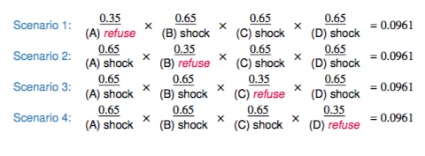

<div class="notes">
Documentation on using ioslides is available here:
http://rmarkdown.rstudio.com/ioslides_presentation_format.html
Some slides are adopted (or copied) from OpenIntro: https://www.openintro.org/
</div>

```{r setup, echo=FALSE, results='hide', warning=FALSE, message=FALSE}
set.seed(2112)
library(ggplot2)
par(mar=c(2.5,1,2,1))
library(knitr)
```

## Announcements

* Our Wednesday, October 31st meetup has been moved to Tuesday, October 30th.


## Meetup Presentations

* 3.18 Mike Silva
* 3.21 Kevin Benson

## Expected Value of Lottery Example

$$ \mu =E\left( X \right) =\sum _{ i=1 }^{ k }{ { x }_{ i }P\left( X={ x }_{ i } \right)  }  $$
```{r, echo=FALSE}
tickets <- as.data.frame(rbind(
	c(    '$1',    1,     15),
	c(    '$2',    2,     11),
	c(    '$4',    4,     62),
	c(    '$5',    5,    100),
	c(   '$10',   10,    143),
	c(   '$20',   20,    250),
	c(   '$30',   30,    562),
	c(   '$50',   50,   3482),
	c(  '$100',  100,   6681),
	c(  '$500',  500,  49440),
	c('$1500',  1500, 375214),
	c('$2500',  2500, 618000)
), stringsAsFactors=FALSE)
names(tickets) <- c('Winnings', 'Value', 'Odds')
tickets$Value <- as.integer(tickets$Value)
tickets$Odds <- as.integer(tickets$Odds)

tickets$xPx <- tickets$Value * (1 / tickets$Odds)
```

```{r}
tickets
sum(tickets$xPx) - 1 # Expected value for one ticket
```

## Expected Value of Lottery Example (cont)

```{r}
sum(tickets$xPx) - 1 # Expected value for one ticket
```

Simulated

```{r}
nGames <- 1
runs <- numeric(10000)
for(j in seq_along(runs)) {
	odds <- sample(max(tickets$Odds), nGames, replace = TRUE)
	vals <- rep(-1, length(odds))
	for(i in 1:nrow(tickets)) {
		vals[odds %% tickets[i,'Odds'] == 0] <- tickets[i,'Value'] - 1
	}
	runs[j] <- cumsum(vals)[nGames]
}
mean(runs)
```

## Milgram Experiment


* Stanley Milgram conducted a series of experiments on obedience to authority starting in 1963.
* Experimenter (E) orders the teacher (T), the subject of the experiment, to give severe electric shocks to a learner (L) each time the learner answers a question incorrectly.


## Milgram Experiment (cont.)

* The learner is actually an actor, and the electric shocks are not real, but a prerecorded sound is played each time the teacher administers an electric shock.
* These experiments measured the willingness of study participants to obey an authority figure who instructed them to perform acts that conflicted with their personal conscience.
* Milgram found that about 65% of people would obey authority and give such shocks.
* Over the years, additional research suggested this number is approximately consistent across communities and time.

## Bernoulli Sequences

* Each person in Milgram’s experiment can be thought of as a trial.
* A person is labeled a success if she refuses to administer a severe shock, and failure if she administers such shock.
* Since only 35% of people refused to administer a shock, probability of success is p = 0.35.
* When an individual trial has only two possible outcomes, it is called a **Bernoulli** random variable.

A random variable X has a *Bernoulli distribution* with parameter *p* if

$$ P(X=1) = p \quad and \quad P(X=0) = 1 - p $$
for $0 < p < 1$


## Geometric distribution

Dr. Smith wants to repeat Milgram’s experiments but she only wants to sam- ple people until she finds someone who will not inflict a severe shock. What is the probability that she stops after the first person?

$$P(1^{st}\quad person\quad refuses) =  0.35$$

the third person?

$$ P(1^{st} and 2^{nd} shock, 3^{rd} refuses) = \frac{S}{0.65} \times \frac{S}{0.65} \times \frac{R}{0.35} = 0.65^{2} \times 0.35 \approx 0.15 $$

the tenth person?

## Geometric distribution (cont.)

Geometric distribution describes the waiting time until a success for *independent and identically distributed* (iid) Bernouilli random variables.

* independence: outcomes of trials don’t affect each other 
* identical: the probability of success is the same for each trial

Geometric probabilities

If $p$ represents probability of success, $(1 − p)$ represents probability of failure, and n represents number of independent trials

$$ P(success\quad on\quad the\quad { n }^{ th }\quad trial) = (1 − p)^{n−1}p $$

## Expected value

How many people is Dr. Smith expected to test before finding the first one that refuses to administer the shock?


The expected value, or the mean, of a geometric distribution is
defined as $\frac{1}{p}$.

$$ \mu = \frac{1}{p} = \frac{1}{0.35} = 2.86 $$

She is expected to test 2.86 people before finding the first one that refuses to administer the shock.

But how can she test a non-whole number of people?

## Expected value and its variability

<center><table width='80%'><tr><td align='center'>
$$ \mu = \frac{1}{p} $$
</td><td align='center'>
$$ \sigma = \sqrt{\frac{1-p}{p^2}} $$
</td></tr></table></center>

Going back to Dr. Smith’s experiment:

$$ \sigma = \sqrt{\frac{1-p}{p^2}} = \sqrt{\frac{1-0.35}{0.35^2}} = 2.3 $$

Dr. Smith is expected to test 2.86 people before finding the first one that refuses to administer the shock, give or take 2.3 people.

These values only make sense in the context of repeating the experiment many many times.


## Milgram Part 2

Suppose we randomly select four individuals to participate in this experiment. What is the probability that exactly 1 of them will refuse to administer the shock

Let’s call these people Allen (A), Brittany (B), Caroline (C), and Damian (D). Each one of the four scenarios below will satisfy the condition of “exactly 1 of them refuses to administer the shock”:

<center>

</center>

The probability of exactly one 1 of 4 people refusing to administer the
shock is the sum of all of these probabilities.

0.0961 + 0.0961 + 0.0961 + 0.0961 = 4 × 0.0961 = 0.3844

## Binomial distribution

The question from the prior slide asked for the probability of given number of successes, k, in a given number of trials, n, (k = 1 success in n = 4 trials), and we calculated this probability as

$$ # of scenarios × P(single scenario) $$

Number of scenarios: there is a less tedious way to figure this out, we’ll get to that shortly...

$$P(single \quad scenario) = p^k (1 − p)^{(n−k)}$$

The *Binomial* distribution describes the probability of having exactly k successes in n independent Bernouilli trials with probability of success p.


## Choose Function

The choose function is useful for calculating the number of ways to choose k successes in n trials.

$$ \left( \begin{matrix} n \\ k \end{matrix} \right) =\frac { n! }{ k!(n-k)! }  $$

For example, :

$$ \left( \begin{matrix} 9 \\ 2 \end{matrix} \right) =\frac { 9! }{ 2!(9-2)! } =\frac { 9\times 8\times 7! }{ 2\times 1\times 7! } =\frac { 72 }{ 2 } =36 $$

```{r}
choose(9,2)
```

## Binomial distribution

If p represents probability of success, (1 − p) represents probability of failure, n represents number of independent trials, and k represents number of successes

$$ P(k\quad successes\quad in\quad n\quad trials)=\left( \begin{matrix} n \\ k \end{matrix} \right) { p }^{ k }{ (1-p) }^{ (n-k) } $$


## Binomial distribution {.columns-2}

```{r, fig.width=6, fig.height=3.25}
n <- 4
p <- 0.35
barplot(dbinom(0:n, n, p), names.arg=0:n)
dbinom(1, 4, p)
```


